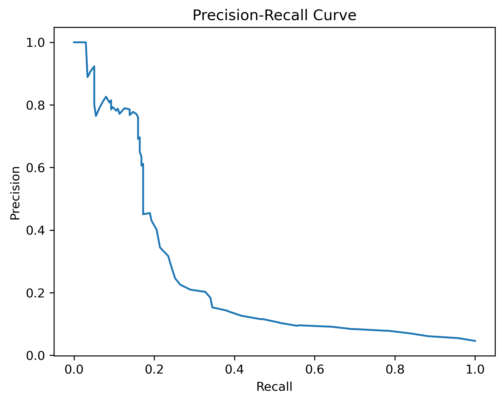

# Prediction of default model
### Project Goal

Разработка модели машинного обучения для банковского сектора с целью снижения потерь от дефолта корпоративных клиентов и повышения качества оценки кредитных рисков.
### Business Problem

Банки несут значительные убытки из-за дефолтов компаний по кредитным обязательствам.
Цель проекта — построить модель, способную заранее выявлять клиентов с высокой вероятностью дефолта.

Даже небольшое улучшение качества скоринга позволяет:

- уменьшить объем проблемных кредитов;
- снизить кредитные потери;
- повысить точность принятия решений риск-менеджмента.
  
### The project has done:

- удаление пропущенных значений (NaN);

- кодирование категориальных признаков через pd.get_dummies();

- удаление высококоррелирующих признаков для борьбы с переобучением;

- балансировка классов с помощью SMOTE.

| Model               | ROC-AUC |
| ------------------- | ------- |
| Logistic Regression | 0.50    |
| Random Forest       | 0.735   |
| XGBoost             | 0.713   |
| LightGBM            | 0.715   |
| Ensemble Model      | 0.710   |

### Best Result

Лучшая модель — Random Forest.

ROC AUC=0.735 (Ранжирование)

### Business effect
При ROC-AUC = 0.735 модель показывает хорошее качество ранжирования в задаче с сильным дисбалансом классов.  
После подбора threshold удалось добиться высокого recall, что позволяет выявлять до ~88% потенциальных дефолтов.

При среднем размере кредита около 5 млн рублей и предполагаемых потерях 50–60% от суммы кредита в случае дефолта, модель потенциально способна снизить кредитные потери на 5 миллиардов  рублей на крупных клиентских выборках.

### Technologies
- Python
- Pandas
- NumPy
- Scikit-learn
- XGBoost
- LightGBM
- Imbalanced-learn (SMOTE)
